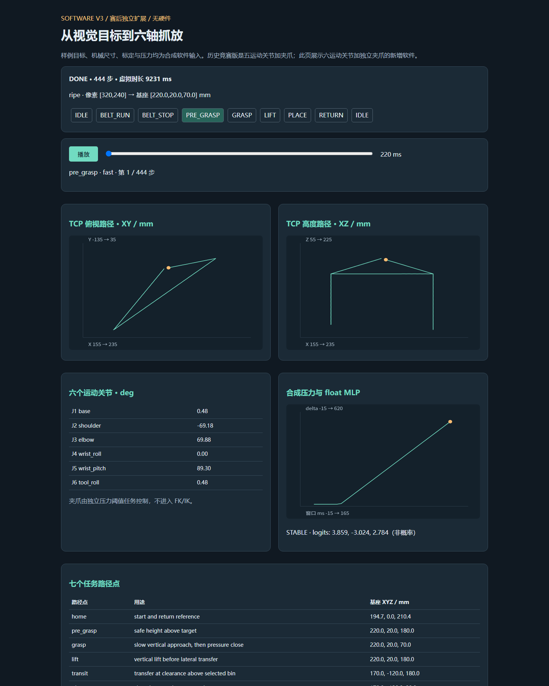

# 草莓眼手力柔性分拣机器人

树莓派 5 负责视觉，Renesas RA6M5 负责执行，UART 连接上下位机。历史固定姿态分拣实物已完成并参赛；目前没有硬件，本次完善以可复现的软件验证为主。

**历史硬件是五个运动关节 + 独立夹爪，共六路舵机。新增 `software_v3` 才是六个运动关节 + 独立夹爪的软件模型，不能当成原竞赛版本或真机升级成果。**

## 版本入口

| 版本 | 入口 | 内容与边界 |
|---|---|---|
| 固定姿态主线（历史竞赛版） | [`vision/pi/main.py`](vision/pi/main.py)、[`mcu/hal_entry.c`](mcu/hal_entry.c) | A/B/C 分拣、固定姿态、步进插值、快慢双速、八状态、压力阈值夹持；原代码保留 |
| pickup_v2（赛后实验升级） | [`pickup_v2/README.md`](pickup_v2/README.md)、[`main_pickup.py`](pickup_v2/pi/main_pickup.py) | 视觉坐标转换、固定世界俯仰约束解析 IK；K 六通道包含夹爪，不是完整六运动轴 IK |
| software_v3（本次软件扩展） | [`demo.py`](software_v3/demo.py)、[设计说明](software_v3/README.md) | 可配置六转动关节 FK/全位姿数值 IK、七路径点、八状态、独立夹爪、协议与模拟 MCU、合成压力分类；无硬件验证 |

[版本与证据说明](docs/VERSIONS.md) · [能力到代码映射](docs/CAPABILITY_MAP.md) · [软件测试记录](docs/SOFTWARE_VALIDATION.md)。历史 `output/` 固件、`pickup_v2` 标定与训练日志全部保留。

## 无硬件演示

在仓库根目录执行，建议 Python 3.11+：

```bash
python -m pip install -r software_v3/requirements.txt
python -m software_v3.demo
python -m pytest software_v3/tests pickup_v2/pi/tests -q
```

打开生成的 `software_v3/artifacts/demo.html`，可播放/拖动 TCP 路径，查看六轴角度、调度状态、七路径点和 MLP 分类。JSON 保存完整轨迹、压力窗口和权重 SHA256。报告可离线打开，不需要相机、YOLO 权重、串口或 MCU。合成检测结果不是 YOLO 实际推理结果。

<details><summary>展开软件演示预览（合成输入，报告局部截图）</summary>



</details>


故障演示（**预期返回码 2**，表示完成故障退出，不表示成功抓取）：

```bash
python -m software_v3.demo --fault unreachable
python -m software_v3.demo --fault timeout
python -m software_v3.demo --fault estop
python -m software_v3.demo --fault no-contact
```

不可达时预检失败，零运动指令；丢失 ACK 时不重试可能已执行的命令，模拟 MCU 看门狗锁存故障；急停/接触超时停止调度和传送带，冻结运动与夹爪命令，不自动回零、松爪或重试。

## 历史实物

下列照片属于历史实物，不是新增六运动轴模型的照片。作品演示视频可联系作者提供。

<p align="center"></p>

| 正面 | 侧面 |
|---|---|
|  |  |


## YOLOv8n 成熟度分类

现有 [`detector.py`](vision/pi/detector.py) 检测 `ripe / semi_ripe / unripe`，树莓派主线映射为 A/B/C。训练配置 [`args.yaml`](vision/runs/strawberry_v12/args.yaml) 记录 `yolov8n.pt`、640 输入、100 轮。

下表统一取原始 [`results.csv`](vision/runs/strawberry_v12/results.csv) **第 100 轮**，不混用最佳轮次或不同运行：

| 指标 | 日志值 | 展示值 |
|---|---|---|
| mAP50 | 0.98801 | **98.8%** |
| mAP50-95 | 0.78906 | 78.9% |
| Precision | 0.97374 | 97.4% |
| Recall | 0.94465 | 94.5% |


这些是历史检测验证指标，不能解释为抓取成功率；仓库没有可确认的 91.1% 抓取统计。权重文件被 Git 忽略，当前演示不下载或重训 YOLO。

## 压力控制与 TinyML 实际实现

- 主线 `fsr_grasp_with_feedback` 通过压力 delta 阈值检测接触并限制继续闭合，不应表述为已验证的 PID 力控。
- [`tinyml_grasp.h`](mcu/tinyml_grasp.h) 是 **float MLP 16→8→4→3，187 参数**，不是 INT8 1D-CNN。取最后 16 个 FSR delta，不足前补零，除以 1000；输出 `STABLE / SLIP_RISK / OVERFORCE`。
- 主线分类后只打印结果和最大 logit，没有将模型分类接入真机夹持闭环调节；最大 logit 不是概率。
- [`train_tinyml.py`](vision/train_tinyml.py) 默认使用合成压力数据，可读取真实 CSV；现有权重没有数据集清单和独立测试集记录，不能确认真实采样来源或泛化精度。详见 [TinyML 证据](docs/TINYML.md)。
- 新模拟压力任务允许配置 **5 ms 调度周期**，与运动等待解耦。虚拟时钟测试不能写成 RA6M5 实测 200 Hz，也不支持 `<1 ms` 推理或微秒级保护的时延结论。

## 历史硬件与协议

| PCA9685 通道 | 用途 |
|---|---|
| CH5 | 底座 |
| CH1 | 肩 |
| CH0 | 肘 |
| CH2 | 腕俯仰 |
| CH3 | 腕旋转 |
| CH4 | 夹爪；不计入六运动轴 |

历史 UART 为 115200 波特率，A/B/C 分拣，G 启动传送带，X 停止；pickup_v2 新增 `M/K/J/OPEN/CLOSE/HOME/PLACE`。**V3 与两条历史协议不兼容**：必须版本、六运动轴模型与独立夹爪能力握手；小写十六进制外层避免历史大写指令被误触发。默认没有真实串口发送入口，见 [协议说明](software_v3/PROTOCOL.md)。

历史 Pi 入口为 `vision/pi/main.py`，需要模型、picamera2、OpenCV、pyserial 与现场配置；历史 MCU 入口为 `mcu/hal_entry.c`，需要 Renesas e2studio/FSP 工程和硬件。不要将 V3 输出发送给历史固件。

## 仍需硬件验证

真实六轴机构与第七执行通道、尺寸/零位/限位和相机标定、碰撞与负载安全、RA6M5 ADC 调度抖动、实际串口与舵机跟踪、压力阈值、果实损伤和抓取统计、模型真实数据分类性能。本次只验证模型数学、配置边界、TCP 过渡高度、插值、模拟收发与故障退出、压力任务和 C/Python MLP 一致性。

## 许可

见 [LICENSE](LICENSE)。
